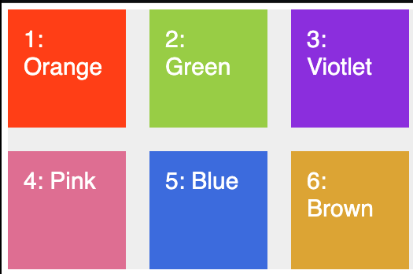

# Basic Grid 


```html
<div class="container">
  <div class="item item--1">1: Orange</div>
  <div class="item item--2">2: Green</div>
  <div class="item item--3">3: Violet</div>
  <div class="item item--4">4: Pink</div>
  <div class="item item--5">5: Blue</div>
  <div class="item item--6">6: Brown</div>
</div>

```


```css
.container {
  background-color: #eee;
  width: 1000px;
  margin: 0 auto;
  
  display: grid;
  grid-template-rows: 150px 150px;
  grid-template-columns: 150px 150px 150px;
  
  // grid-row-gap : 30px;
  // grid-column-gap: 50px;
  grid-gap: 30px;
}

.item {
  padding: 20px;
  font-size: 30px;
  font-family: sans-serif;
  color: white;
}
.item--1 {
  background-color: orangered;
}
.item--2 {
  background-color: yellowgreen;
}
.item--3 {
  background-color: blueviolet;
}
.item--4 {
  background-color: palevioletred;
}
.item--5 {
  background-color: royalblue;
}
.item--6 {
  background-color: goldenrod;
}

```



# repeat & fractional unit


```css
  grid-template-rows: repeat(2,150px);
  grid-template-columns: repeat(2,150px) 300px;

```


```css
grid-template-rows: repeat(2,150px);
grid-template-columns: repeat(2,150px) 1fr;

```


```css
  grid-template-rows: repeat(2,150px);
  grid-template-columns: repeat(3,1fr);

```


```css
  grid-template-rows: repeat(2,150px);
  grid-template-columns: 1fr 2fr 1fr;
```


ถ้าใช้กับหน่วยเปอร์เซ็น ตัว grid cell จะมีขนาดตามที่กำหนด (โดยไม่นับ gutter) เช่น container กว้าง 1000px ตัว cell ก็จะกว้าง 500 px

```css
  grid-template-rows: repeat(2,150px);
  grid-template-columns: 50% 2fr 1fr;
```

