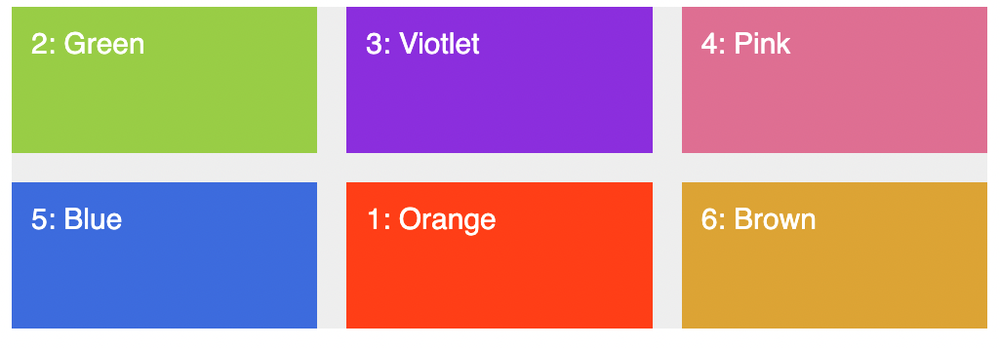
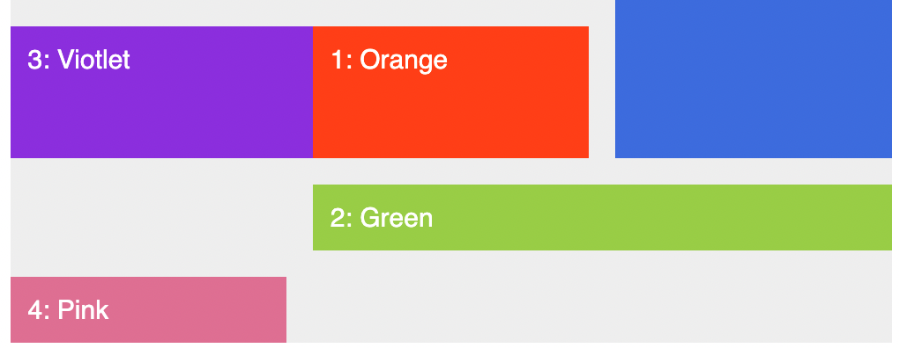

ref : https://codepen.io/pavitpim/pen/NWyBdPy?editors=1100

# Basic Grid

```html
<div class="container">
  <div class="item item--1">1: Orange</div>
  <div class="item item--2">2: Green</div>
  <div class="item item--3">3: Violet</div>
  <div class="item item--4">4: Pink</div>
  <div class="item item--5">5: Blue</div>
  <div class="item item--6">6: Brown</div>
</div>
```

```css
.container {
  background-color: #eee;
  width: 1000px;
  margin: 0 auto;

  display: grid;
  grid-template-rows: 150px 150px;
  grid-template-columns: 150px 150px 150px;

  // grid-row-gap : 30px;
  // grid-column-gap: 50px;
  grid-gap: 30px;
}

.item {
  padding: 20px;
  font-size: 30px;
  font-family: sans-serif;
  color: white;
}
.item--1 {
  background-color: orangered;
}
.item--2 {
  background-color: yellowgreen;
}
.item--3 {
  background-color: blueviolet;
}
.item--4 {
  background-color: palevioletred;
}
.item--5 {
  background-color: royalblue;
}
.item--6 {
  background-color: goldenrod;
}
```


# repeat & fractional unit

```css
grid-template-rows: repeat(2, 150px);
grid-template-columns: repeat(2, 150px) 300px;
```


```css
grid-template-rows: repeat(2, 150px);
grid-template-columns: repeat(2, 150px) 1fr;
```


```css
grid-template-rows: repeat(2, 150px);
grid-template-columns: repeat(3, 1fr);
```


```css
grid-template-rows: repeat(2, 150px);
grid-template-columns: 1fr 2fr 1fr;
```


ถ้าใช้กับหน่วยเปอร์เซ็น ตัว grid cell จะมีขนาดตามที่กำหนด (โดยไม่นับ gutter) เช่น container กว้าง 1000px ตัว cell ก็จะกว้าง 500 px

```css
grid-template-rows: repeat(2, 150px);
grid-template-columns: 50% 2fr 1fr;
```


Note : หน่วย fr ใช้ได้ทั้ง row และ column

# POSITIONING

- css rule ต่อไปนี้อ้างอิงจากตัวเลขที่ชื่อว่า `grid line`

```css
.item--1 {
  background-color: orangered;
  grid-row-start: 2;
  grid-row-end: 3;
  grid-column-start: 2;
  grid-column-end: 3;
}
```

shorthand

```css
.item--1 {
  background-color: orangered;
  grid-row: 2/3;
  grid-column: 2/3;
}
```



`grid-area`

```css
.item--5 {
  background-color: royalblue;
  /* grid-row: 1/2;
  grid-column: 3/4; */
  grid-area: 1/3/2/4;
}
```


# SPAN

มีวิธี span 3 แบบ

- ใช้เลข grid line
- ใช้ span
- ใช้ เลบติดลบ

```css
.item--1 {
  background-color: orangered;
  grid-row: 2/3;
  grid-column: 2/4;
}
```


grid ที่ล้นมาจะเรียกว่า `implicit grid`

บางทีอาจจะเจอผลลัพธ์แปลกๆเช่น

```css
.item--3 {
  background-color: blueviolet;
  grid-column: 1/3;
}
```


เป็นเพราะ item 1,6,5 ล็อคที่ไว้แล้ว แล้ว 2 ต้องมาก่อน 3
พอคำนวณแล้ว 3 ไม่มีที่ลงเลยต้องขึ้น row ใหม่ (ต้องให้ไม่ fixed item 1 ก็ให้ผลลัพธ์ตามเดิม เพราะ 1,2 มาก่อน 3 )

อีกแง่นึงคือเราพยายามจะวางซ้อนกัน มันเลยหาที่ใหม่

แต่ถ้าล็อคแถวแบบนี้ด้วย (explicit) คือจะวางทับกันเลย (สังเกตว่า item 1 หายไป) สามารถปรับ z-index ให้ item-1 ขึ้นมาอยู่ด้านบนได้

```css
.item--3 {
  background-color: blueviolet;
  grid-column: 1/3;
  grid-row: 2/3;
}
```


## การใช้ span

span : แทนจำนวน cell ที่ต้องการ ถ้าใส่เกินจะล้นจะ auto create new column or row

```css
.item--2 {
  background-color: yellowgreen;
  grid-column: 1 / span 2;
}
```


```css
.item--2 {
  background-color: yellowgreen;
  grid-column: 2 / span 2;
}
```



ถ้่าจำไม่ได้ว่ามีกี่แถวหรือหลักกันแน่ให้ใช้ -1

```css
.item--2 {
  background-color: yellowgreen;
  grid-column: 2/-1;
}
```


# WORKSHOP

https://codepen.io/pavitpim/pen/BaYPWBG  


### ตั้งชื่อให้กับ grid line ได้

- ตั้งได้หลายชื่อใน [name-1 name-2]
- ใน repeat จะใช้เป็นชื่อ suffix เช่น [col-start] จะตั้งเป็น col-start 1

```css
grid-template-rows: [header-start] 100px [header-end box-start] 200px [box-end main-start] 400px [main-end footer-start] 100px [footer-end];
grid-template-columns: repeat(3, [col-start] 1fr [col-end]) 200px [col-grid-end];
```

## วิธีการใช้ grid-template-areas

- ตั้งชื่อแต่ละ grid cell ได้เลยโดยใช้ square bracket
- หาก cell ไหนต้องการเว้นให้ใช้ `.`
- cell อื่นจะถูกร่นขึ้นมา ดังนั้นอาจจะต้องตั้งชื่อให้ specific (เช่นในกรณี box-1 ถึง box-3)

```css
.container {
  width: 1000px;
  margin: 30px auto;

  display: grid;
  grid-template-rows: [header-start] 100px [header-end box-start] 200px [box-end main-start] 400px [main-end footer-start] 100px [footer-end];
  grid-template-columns:
    repeat(3, [col-start] 1fr [col-end])
    200px [col-grid-end];
  grid-gap: 30px;

  grid-template-areas:
    "head head head ."
    "box-1 box-2 box-3 side"
    "main main main side"
    "foot foot foot foot";
}

.item {
  background-color: orangered;
  padding: 20px;
  color: white;
  font-size: 30px;
  font-family: sans-serif;
}

.header {
  grid-area: head;
}

.sidebar {
  grid-area: side;
}
.small-box-1 {
  grid-area: box-1;
}

.small-box-2 {
  grid-area: box-2;
}

.small-box-3 {
  grid-area: box-3;
}
.main {
  grid-area: main;
}

.footer {
  grid-area: foot;
}
```

# EXPLICIT & IMPLICIT

- grid cell ที่เกินจาก grid-template จะเป็น explicit grid (สามารถสังเกตใน dev tool ได้)
- implicit grid จะ fit ตาม content เว้นแต่ว่ากำหนด `grid-auto-rows`
- implicit grid จะเพิ่มจำนวนแถว หรือ ไม่ก็กำหนด `grid-auto-flow : column` แทน (หากไม่กำหนดจะมี defualt ค่าคือ row)
- หากกำหนด `grid-auto-flow : column` จะสามารถใช้ `grid-auto-columns` เพื่อกำหนดความกว้างของ implicit grid cell ได้

```css
display: grid;
grid-template-rows: repeat(2, 150px);
grid-template-columns: repeat(2, 1fr);
grid-gap: 30px;

grid-auto-rows: 80px;

grid-auto-flow: column;
grid-auto-columns: 0.5fr;
```


https://codepen.io/pavitpim/pen/VwQBXKj?editors=1100

# ALIGN & JUSTIFY CELL

- justify จัดซ้ายขวา (แนว horizontal, row)
- align จัดบนล่าง (แนว verticle, column)
- ตำแหน่งจะอ้างอิง grid area ของ grid cell นั้นๆ (ระวังผลลัพธ์แปลกๆของตัวที่มีการ span หรือ กินที่หลาย cell)

```css
//  ใช้กับ container // STRETCH/ center / start / end
.container {
  align-items: center;
  justify-items: center;
}

// ใช้กับ item // STRETCH/ center / start / end
.item {
  align-self: start;
  justify-self: start;
}
```


# ALIGN & JUSTIFY CONTENT

- เราสามารถจัดตำแหน่ง content ได้
- โดยการจัดนี้จะเป็นการจัดตำแหน่งของ grid track (ทุก cell ในแนวนอน หรือแนวดิ่ง)

```css
// Align grid tracks to grid container;
.container {
  grid-template-rows: repeat(2, 100px);
  grid-template-columns: repeat(2, 200px);
  height: 1000px;

  justify-content: center; // START / center / end / space-between / space-around / space-evenly;
  align-content: center;
}
```

จากรูปจะเห็นว่า grid track จะอยู่ตรงกลาง container (ไม่ชิดซ้ายบน ตามเดิม)


# dense

- `dense` ทำให้ grid ไม่มีช่องว่าง มักใช้เวลาจัดรูปภาพแล้ว เกิด implicit grid + hole

# max-content min-content

- The `max-content` sizing keyword represents the intrinsic `maximum width or height of the content`. For text content this means that the content `will not wrap at all even if it causes overflows`.
- `max-content` ขยายตามขนาดทั้ง width,height ไม่ wrap ปล่อย overflow

The `min-content` sizing keyword represents the intrinsic `minimum width` of the content. For text content this means that the content will take all `soft-wrapping` opportunities, becoming as `small as the longest word`.

- `min-content` wrap โดยอิงจากคำที่ที่ยาวที่สุด แต่ถ้ามีคำเดียวยาวๆก็ overflow ได้เช่นกัน

- `minmax(150px,50%)` กำหนดขนาดของ grid เป็นช่วง  

# auto-fill, auto-fit

`key-concept` : สามารถใช้ทำ responsive ได้โดยไม่ต้องเขียน media-query เลย

  - `auto-fill` : เพิ่ม grid track ให้เต็มความกว้างโดยอัติโนมัติ ถึงแม้ track ที่เพิ่มมาจะไม่มี content
  - `auto-fit` : เหมือนกับ auto-fill ต่างกันที่ track หากไม่มี content จะถูก wrap จนเหลือ 0px 
  - ไม่ว่าจะใช้ตัวใด หากแถวแรกมีความกว้างเหลือ grid-cell ของแถวที่สองจะไปต่อท้ายทันที (ทำให้มี 1 แถวได้)

use case 
 - ใช้ `auto-fit` ร่วมกับ minmax
 - หากความกว้างไม่พอกับค่า min จะขึ้นแถวใหม่ (ตัว min เป็นตัวกำหนดการ wrap)
 - ใช้ `grid-auto-rows` ช่วยกำหนดความสูงของ implicit-grid

```css
.item {
  width:90%;
  
  grid-template-rows: repeat(2, minmax(150px,min-content));
  // grid-template-columns: repeat(auto-fill,100px);
  grid-template-columns: repeat(auto-fit,minmax(200px,1fr));
  
  grid-auto-rows: 150px;
}

```